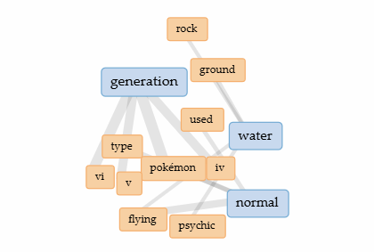



# Distant Reading Assignment 

I used Voyant to search this website! [Pokemon Website!](https://pokemon.fandom.com/wiki/List_of_Pok%C3%A9mon)

I learned things.

Check out my image!

---
I also tried Copilot! With ChatGPT-5 and here's a bit of our conversation:

asd;fads;kfasdfjasd;flkjda
adf;had;kfjfhadsk;fhad
asdk;fhda;kjffhda;kfgad
a;kfhad;skjfhad;sjk;ahdsf;k

